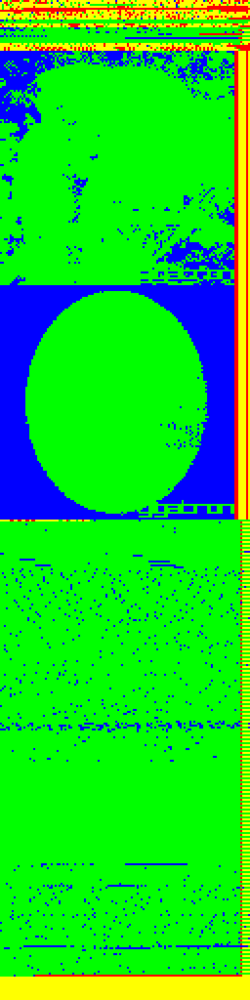

# Migen Gigatron

An attempt to implement the
[Gigatron TTL Microcomputer](https://gigatron.io/)
on an
[FPGA](https://en.wikipedia.org/wiki/Field-programmable_gate_array), specifically the
[TinyFPGA BX](https://tinyfpga.com/bx/guide.html) using 
[Migen](https://m-labs.hk/migen/).

## Why?

To learn Migen and a bit more about FPGA programming. I've previously
[messed around with FuPy](https://nick.zoic.org/art/fupy-micropython-for-fpga/)
but it's a pretty complicated place to dive in.

Also I'm just blown away by what the Gigatron creators have achieved from
[so few parts](doc/Schematics.pdf)
and how much this would have changed the history of personal computing
if Woz had homebrewed something like this instead of the 
[MOS 6502](https://en.wikipedia.org/wiki/MOS_Technology_6502) in the 
[Apple 1](https://en.wikipedia.org/wiki/Apple_I).

### It's already been done ...

[Yeah, but in Verilog.](https://github.com/menloparkinnovation/menlo_gigatron)

# Building

## Tools

Other than a bunch of Ubuntu packages, and some of the Python libraries, 
everything is pulled in as submodules and built within the tree, or at least that's the idea.

```
    git submodule update --init --recursive

    cat ubuntu-packages.txt | xargs sudo apt install -y

    make -j$(nproc)

    pip install -e migen/
    pip install tinyprog
```

## Gateware

```
    PATH=$PWD/build/bin:$PATH 
    python3 test.py
```

## Programming

First [make sure systemd modemmanager isn't messing with you](https://nick.zoic.org/art/failed-to-set-dtr-rts-systemd-modemmanager/) 

Then you can run tinyprog to copy the gateway onto the FPGA.  Press the reset button and then:

```
    tinyprog -p build/test.bin
```

# Hardware

## I/O

The Gigatron board is almost all logic, which can be fit into the FPGA gateware.  There's some
I/O circuitry around the edges, eg: for the audio and video outputs, but that can be built
on strip-board easily enough, with the TinyFPGA board fitting into headers.

There are 41 user I/O pins available, and the Gigatron only needs 8 digital outputs for video,
another 8 for blinkenlights and audio and a single input pin for the game controller (`SER_DATA`)

Some of the pins and analogue circuitry could be dispensed with by adding in a PWM circuit for
the audio output.

## Memory

### RAM

Here we hit the first hurdle: the ICE40LP8K FPGA used on the TinyFPGA BX board has only
128K*bit* = 16KByte of block RAM and the Gigatron needs 32KByte = 256Kbit of RAM.
Ooops.  So our options are:

1. Add an external static RAM to the project.
2. Wait around for the TinyFPGA EX to be ready, which should have plenty of RAM.
3. Develop on a slightly *less* tiny platform, eg:
   [Artix A7](https://www.xilinx.com/products/silicon-devices/fpga/artix-7.html) or similar.
4. Make a cut-down version of Gigatron for the moment.

Part of the attraction of using Gigatron for this project was compatibility with the
[Gigatron ROM](https://github.com/kervinck/gigatron-rom) but I think I'll run with option
4 for the moment, and make a cut down gigatron with the intention of expanding it by 
methods 1 or 2 later.

Option 3 would mean a whole different and non-Open Source toolchain,
so I'm not keen on that.
At least for now we can get the CPU sorted out with 16KByte of RAM addressable.

### ROM

There's also a substantial amount of ROM required ... 64Kwords = 128Kbytes of it!
The Gigatron is a [Harvard Architecture](https://en.wikipedia.org/wiki/Harvard_architecture)
processor, so the ROM is separate from RAM and in this case is 16 bits wide as opposed
to the 8 bit wide RAM.

When running, the soft-CPU will need to retrieve its ROM code from the SPI Flash on the
TinyFPGA BX board.

### Temporary Solution

For now, I'll set up two blocks of on-chip SRAM: one 8 bit x 8192 word read-write memory 
for the RAM, and one 16 bit x 4096 word read-only memory for the ROM.

(There's also bigger versions of the ICE40 with more RAM available, for example
the "UltraPlus" parts like the ICE40-UP5K ... these have an extra
16 bit x 64Kword worth of "SPRAM" (Single Ported RAM) which would be rather handy.
Sadly that's still not quite enough for both RAM and ROM, but it's closer!

### ROM Compression

It's pretty obvious looking at it that the ROM is sparse: there's no "copy from ROM" 
instruction so data has to get loaded in using `LD $XX` instructions.  To make it a 
bit clearer, here's a graphical representation of the ROM, with green pixels representing
"LD" instructions (opcode=0) and blue pixels representing zero words (opcode=0, data=0)



I'm thinking some kind of lookup table could pack these pages a bit more tightly in
the internal RAM, thus scavenging back some storage to fit in the actual RAM.
